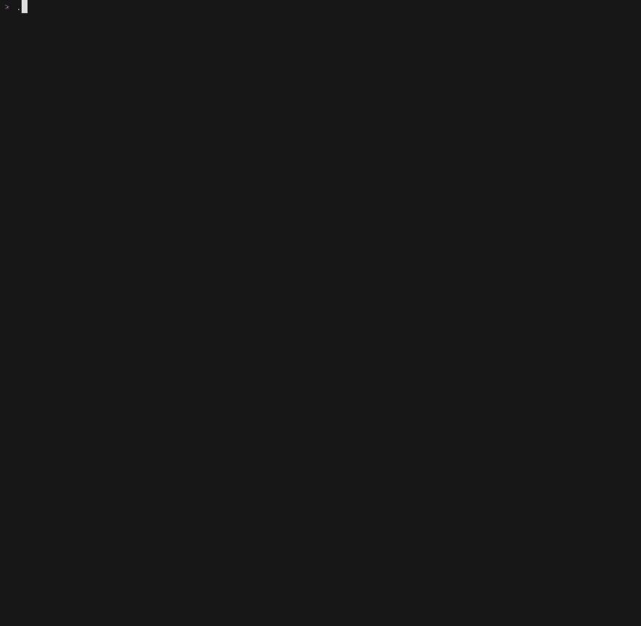

# news-tui

A terminal-based news aggregator, built with Go and Bubble Tea.

!

## Features

- Aggregates news from multiple media sources
- Live search across all scraped articles
- Pagination with keyboard navigation
- Persistent local storage and articles are deduplicated across runs
- Only open articles you want to read with minimal distraction

## Requirements

- Go 1.21+
- GCC (required for SQLite via `go-sqlite3`)

## Installation

```bash
git clone https://github.com/rickysurya/news-tui
cd news-tui
go mod tidy
go build -o news-tui .
```

## Configuration

Copy `.env.example` to `.env` and fill in your sources:

```bash
cp .env.example .env
```

```env
URL_1=
URL_2=
URL_3=

SELECTOR_1_CONTAINER=
SELECTOR_1_TITLE=
SELECTOR_1_LINK=

SELECTOR_2_CONTAINER=
...
```

Each `URL_N` is a page to scrape. Each `SELECTOR_N_*` group defines the CSS selectors for extracting article titles and links from that page. The number of selector groups should match or exceed the number of URLs.

## Usage

```bash
./news-tui
```

The app scrapes configured sources on startup, saves new articles to a local SQLite database, then launches the TUI.

## Keybindings

| Key | Action |
|-----|--------|
| `j` / `↓` | Move down |
| `k` / `↑` | Move up |
| `n` / `→` | Next page |
| `p` / `←` | Previous page |
| `/` | Search |
| `esc` | Clear search |
| `enter` | Open in browser |
| `q` / `ctrl+c` | Quit |

## Stack

- [Bubble Tea](https://github.com/charmbracelet/bubbletea) — TUI framework
- [Colly](https://github.com/gocolly/colly) — scraping
- [go-sqlite3](https://github.com/mattn/go-sqlite3) — local storage

## License

MIT
